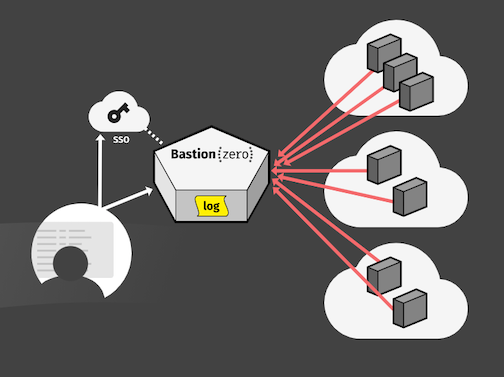
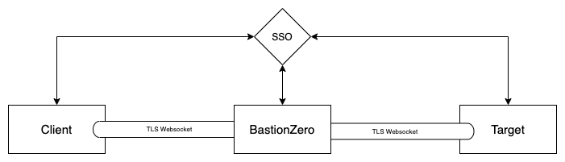
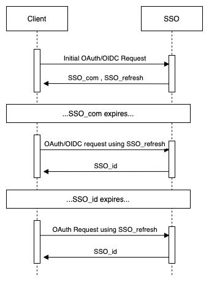
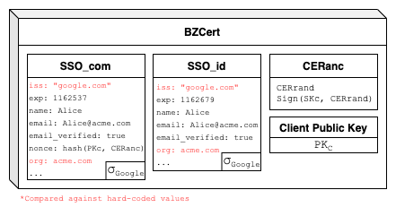
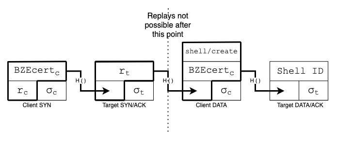
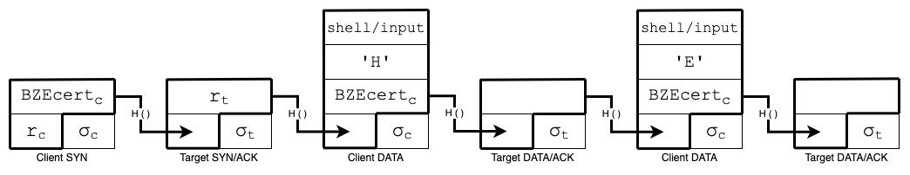
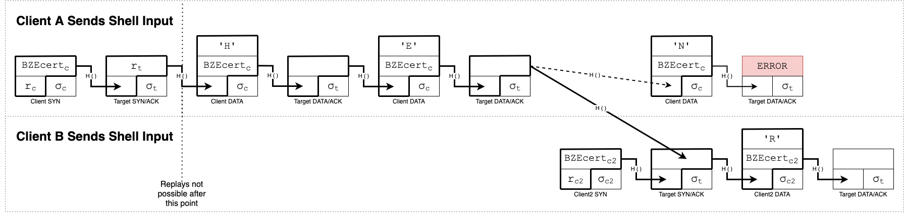

# BastionZero’s Multi Root Zero-Trust Access Protocol (MrZAP)

This living document serves as an overview of BastionZero’s zero-trust access protocol and its use cases.  To learn more about BastionZero and its product, visit [https://www.bastionzero.com/](https://www.bastionzero.com/).  If you have any questions about the document or protocol itself, please contact lucie@bastionzero.com.

## 1 Introduction

BastionZero’s Multi Root ZeroTrust Access Protocol (MrZAP) is a zero-trust, authenticated messaging protocol for remote system access. Among its many uses, it is a secure, scalable, and highly manageable, modern replacement for Secure Shell (SSH).  SSH is a popular, existing solution for running shell commands on remote computers but requires burdensome key management and ties a user’s identity to that key, meaning that anyone with a given key can execute commands on the remote system.  

BastionZero uses an organization’s identity management system to decentralize trust and provide a cryptographically-provable, immutable audit log of the access, actions, and keystrokes performed by users on remote systems. It augments existing trusted identity management systems (e.g. SSO), such that the identity manager is no longer a single point of compromise.  

Each party member of the system can independently validate an incoming message and keep an immutable record of the entire conversation.  This protocol is implemented as part of BastionZero to provide secure, authenticated remote access to managed systems.

**Dual Consent:** The target (e.g. computer or server in the customer’s environment) will not accept any remote commands without the approval from both BastionZero and the user.   BastionZero can veto access based on configured policy while the target will only accept commands from and signed by legitimate users.

**Multi-Root Zero-Trust:** The target system will not execute remote commands sent from BastionZero unilaterally, nor completely trust the user to execute within their allowed permissions.  Trust is decentralized and access requires cryptographic authorization from at least two independently operated systems: the user’s identity provider AND BastionZero.  This minimizes the trust placed in any single component of the system and protects against any single, compromised party.

**No Unilateral Access:** The target system will only accept remote commands that come from an authorized user correctly associated with the target; BastionZero cannot successfully issue arbitrary commands.

**Immutable Logs:** All messages sent by the user to the remote system are digitally signed and connected via message chain to create a real-time, independently-verifiable audit log that cannot be tampered with or altered even in the event of compromise.

## 2 The Protocol

### 2.1 Overview

BastionZero’s Multi Root Zero-Trust Access Protocol (MrZAP) is an authenticated, signature-based access protocol.  A user logs in using their Client and sends a command to a remote computer, server, or system in the user’s environment (heretofore referred to as the “Target”); the Target independently verifies and authenticates the user’s identity, checks the digital signature on the command and then executes the command.  Every message is associated with the user’s identity and the antecedent message; no intermediary is able to impersonate the user.

Core to the protocol is a short-lived, ephemeral ed25519[^2] curve signature key pair held by the user, which can be revoked at user request by BastionZero.  The user’s identity is managed and certified by their organization’s Single Sign-on Identity Provider (“SSO”) such as Google or Okta.  Keys are generated anew each time the user signs in and expire when the user signs out. Although the generation is transparent to the user, it does not change the user’s experience of the normal login flow.  No changes or new configurations are required.

When the user logs in, their SSO digitally signs both the user’s ephemeral public key as well as their identity. This signed attestation from the SSO is referred to as the BastionZero Certificate (“BZCert”).  This serves to cryptographically convince the Target that the user’s ephemeral key is valid and has been authenticated and approved by both the user’s SSO and BastionZero.

The protocol starts with a two-message authenticating exchange, called the “MrZAP Handshake,” where the initiating Client communicates the user’s identity and public key—in the form of a BZCert—to BastionZero which, if approved, is then forwarded to the Target. By reaching out to the user’s SSO, the Target and BastionZero, can independently verify the user’s claims; there is no unilateral trust in the Client to correctly report user identity. The Target will verify the user’s identity in every message sent after verification.

Every subsequent message is associated both with this initial handshake and the antecedent message by use of a hash pointer.  Messages are digitally signed by either the user or the Target, using their respective key pairs. The hash pointer allows for immutable logs and prevents BastionZero from reordering, manipulating, or removing messages while signatures prevent illegitimate actors from impersonating legitimate users.

### 2.2 Multi Root Zero Trust

Engineers need access to remote resources with controls sufficient to reduce internal threats and a trust model to reduce external ones.  Availability, reliability, and security are paramount to any access tool, yet existing solutions to this problem congregate trust into a single point of compromise.

No piece of software or infrastructure is without vulnerability, but in many existing products, each individual vulnerability increases the probability that the entire system will be compromised.  This is because the security relies heavily on the trust placed in single components of the access service.  Adversaries rely on this trust model to allow for compromise of entire systems based on single, devastating vulnerability exploitation.  

BastionZero’s protocol does not eliminate the need for trust, rather it minimizes the amount of trust required for any single party in the system. It distributes trust into multiple roots of that trust such that no unique entity can behave maliciously and violate security.  No party is trusted by any other implicitly and, therefore, there is some unique root of trust for each of the three actors: Client, BastionZero, and the Target. 

This distribution of trust means that there is no single point of compromise, and breaking the trust model would require multiple parties to conspire jointly to be successful.

#### 2.2.1 What if BastionZero is compromised?

If BastionZero and only BastionZero is compromised, then the attack model is limited.  Any actor with unfettered access to BastionZero will be able to read or block messages as they pass through.  However, the malicious actor would be unable to execute commands on a registered Target because they do not have an account with the Target’s associated SSO.  Targets will still require a valid and independently verifiable user in order to execute commands and, therefore, access will still be appropriately restricted and the authentication trust model will still hold.

#### 2.2.2 What if the user’s SSO is compromised?

If the user’s SSO is compromised but the user has additional, uncompromised MFA protection, then compromise of the user’s BastionZero account is not possible.  The customer’s SSO proves the user’s identity in relation to the external entity, but MFA is used to bolster that by forcing an additional factor of authentication to BastionZero itself.  Compromising the SSO would not give the malicious user access to the legitimate user’s MFA which would prevent them from successfully logging into BastionZero.

#### 2.2.3 What if BastionZero and the user’s SSO are both compromised?

Only if BastionZero and the external SSO were compromised would a malicious user be able to successfully authenticate to BastionZero.  This is also assuming that in compromising BastionZero, the malicious actor removes any MFA authentication requirements.  Obtaining such access would indicate a more sophisticated attacker than one capable of solely achieving read-only access.  

This scenario is improbable because it requires the compromise of multiple components of the system (SSO and BastionZero) which increases the difficulty and discoverability of the attack.  This increased complexity is the desirable consequence of the multi-root zero-trust nature of the MrZAP protocol, which means there is no single point of compromise.

### 2.3 Identity Tokens

The Client’s identity is ensured by an external identity management system such as a company’s Single Sign-On provider (SSO). The MrZAP protocol relies on the use of OAuth tokens to communicate with these external SSOs in order to establish and decentralize trust.  

OAuth is a framework that offers several ways of authenticating to a given online application.  Authorization is presented in the form of identity tokens that attest both to a user’s identity while confirming authorization to use the desired application.  OIDC[^1] is a layer built on top of OAuth to improve the protocol’s security;  from here on, OAuth implemented with OIDC will be referred to simply as OIDC.  

BastionZero uses Authorization Code Flow with Proof Key for Code Exchange (PKCE), but the important specifics of the token negotiation are abstracted and could be applied to multiple different OIDC flows. The particular exchange of interest is detailed in the diagram below.  

MrZAP specifies three different OIDC tokens within the protocol: `SSO_com`, `SSO_id`, `SSO_refresh`.

The opening OIDC request for an identity token is responded to with the `SSO_com` and `SSO_refresh`. The `SSO_com` is the initial identity token that commits to the requestor's identity and echos the nonce if one was provided during the request.  There is no guarantee that this nonce will be included in any subsequent id token and therefore this first token has significant value.  To distinguish this significance, the unexpired, valid identity token is referred to as the `SSO_id` in the protocol. 

Identity tokens have expiration dates and when one of these is reached, which may happen as frequently as every ten minutes, the user must renew their authorizing identity token to continue communicating with an application. The `SSO_refresh` refers to the long-lived refresh token a Client can use to get new identity tokens from the SSO without being re-prompted.

### 2.4 BastionZero Certificate

There are two integral identities in MrZAP: the identity as defined by the user’s SSO and the cryptographic identity as defined by a public, secret key pair.  The former ensures legitimacy as a user of the application while the latter allows the user to sign messages and have signatures independently verified.

OIDC uses a client-provided nonce in the opening request for replay protection.  MrZAP takes advantage of this field and uses it to create a 3rd-party-signed attestation to the user’s signature key pair while preserving its efficacy as replay protection.  

BastionZero sends the nonce in the following format:

>`Hash(PK``C``, CERrand, (CERrand)σ``C``)`, where  
>`PK``C` is the Client’s Public Key 
>`CERrand` is a random value 
>`(CERrand)σ``C` is the Client's signature on `CERrand`

Hashing allows the information to fit protocol-defined size constraints, while the `CERrand` ensures replay protection is maintained.  Including both the user’s public key and signature on the random value forces the SSO to publish the public key while proving possession of the corresponding secret key.  

However, because the nonce is the hash of the above information, the protocol requires some way to communicate what is being hashed. This is solved by use of a certificate that contains the additional information required to validate the user’s nonce.

Below is an example of a BZCert for a user Alice who uses Google as her SSO provider.  The Target compares Alice’s claims against hard-coded values injected during Target registration.

BastionZero Certificate (“BZCert”) validation includes verifying:

1. A properly formatted nonce in the `SSO_com` including a valid signature on `CERrand`

    >`Nonce = Hash(PK``A``, CERrand, (CERrand)σ``A``)`
2. An unexpired, valid `SSO_id`
3. A valid SSO provider’s signature on both the `SSO_com` and `SSO_id`
4. That user’s organization (“org”) matches that expected by the Target 
5. That user’s issuer (“iss”) matches that expected by the Target

Any change to the BZCert, such as the expiration of the SSO_id will require the creation of a new certificate. Each unique certificate requires its own handshake.

### 2.5 The Handshake

Every message in the MrZAP protocol includes the hash of the previous message and the signature of the dispatching party.  However, hash chains require randomness in order to protect against replay attacks and signatures require verified identities to protect against access by unauthorized parties.

MrZAP uses a two-message, Client-initiated handshake to start protocol communication between the Client and a Target.  This serves to communicate the user’s identity, have the Target verify it, and anchor the hash chain to a unique starting value.  Having two unique, random values protects against a single malicious party who could specify an existing “random” value that had already been used and replay a captured, legitimate message sequence against the Target.

The MrZAP Handshake convinces the Target of four things:

1. The user is who they say they are because the user has been authorized by their organization's SSO and BastionZero.
2. BastionZero has approved the user’s access to the target with a particular privilege level based on existing, configured policy.
3. The user has the presented public key.
4. The user possesses the corresponding secret key to the ephemeral public key presented in the BZCert.

Where, 

>`BZCert``c` is the user’s identity certificate  
>`r``c` is a random value, chosen by the Client 
>`r``t` is a random value, chosen by the Target 
>`σ``c` is the Client’s signature over the message, `Sign(SK``c``, BZCert``c`` || r``c ``)` 
>`σ``t` is the Target’s signature of the message, `Sign(SK``t``, H(SYN) || r``t``)`

In the first message, called the SYN message, the Client sends the user’s BZCert, a random value, and a signature over the entire message to the Target.  After verifying the user’s BZCert, The Target responds with a SYN/ACK which includes an additional random value and a hash of the SYN message—omitting the signature from the hash calculation—and a signature over the entire message.  Then, the Client can continue communication by sending a DATA message.

After verifying and before responding with a SYN/ACK, the Target will store the BZCert.  Thereon, the Client will include the BZCert with every message, even if only in its hashed form.  This is so that the Target can associate received messages with a verified BZCert from a previous, successful MrZAP Handshake. 

Because BZCerts are constantly expiring—based on the lifetime of a single identity token (SSO_id)—the Client is constantly creating new certificates. The Client will initiate a new handshake for each unique BZCert so that the Target can properly verify and store it.

### 2.6 Message Exchange

The MrZAP messaging protocol uses 4 different types of messages: SYN, SYN/ACK, DATA, and DATA/ACK.  The SYN and SYN/ACK are used for the MrZAP Handshake, as detailed above, and all other communication takes the form of a DATA and DATA/ACK exchange.  Communication is driven by the Client, meaning SYN and DATA messages are reserved for their use while the SYN/ACK and DATA/ACK messages are both for use exclusively by the Target.

DATA and DATA/ACK exchanges continue the same message pattern established above in the handshake:

1. The Client is always the initiator
2. Every message includes the hash pointer of the previous
3. Every message is signed by the sending party

This means that the Target’s verification of any given message covers these three points.  The Target will always verify that:

1. The Client-provided BZCert matches a previous successful handshake and is still valid.
2. The hash pointer points to the previous ACK sent by the Target.
3. There is a valid signature on the message, verified using the public key provided in the  BZCert.

MrZAP messages are _action_-driven.  This means that each message has a desired action, for example opening communication with a shell.  Below, is an example of a handshake with the desired effect of opening a shell on the Target.  In this case, the action is “shell/create.”  When the Target has completed this action, it will return a DATA/ACK in response to imply successful completion of the action.  Otherwise, an ERROR message is returned.

Similarly, if a Client wants to send keystrokes to the shell, they would specify “shell/input” as the action.  Below is an example, sending keystrokes to the Target.  In this example, the Target does not include additional information in its responses; the ACK itself implies success.

### 2.7 Attachment

Although there are many use cases, the following attachment scenarios will focus on shell-related attachment.  

A common desire is to connect to shells that are already active either by the same user using a different Client or a new user wishing to collaborate.  In response to this, MrZAP allows for “shell attachment,” or connection to an already active shell session.  This allows new Clients to join existing sessions without corrupting logs and maintaining the immutability of the MrZAP exchange.

Because MrZAP requires an active OAuth session, if a user logs in to a different Client, it cannot use an existing BZCert.  This means that every time the user logs in, they have to re-initiate a MrZAP Handshake.  However, because MrZAP allows multiple valid BZCerts to connect to a given session, any number of authorized Clients can communicate with a given shell.

The message flow functions the same during shell attachment as for shell communication, the only differentiation is the treatment of the SYN/ACK’s random value.  When a new Client joins, the Target uses the hash of the most recent acknowledgement message instead of including a true random value to preserve the session’s immutable hash chain.  There is a single active Client at any given time who controls the flow of the hash pointers.

In the above example, Client A initiates a handshake and begins to send shell input to the Target.  Then, Client B indicates their desire to communicate with Client A’s shell by initiating a handshake, which points the session’s “current” value at the resulting hash of the SYN/ACK.  When Client A tries to send another keystroke, they receive an error message because they have built their message using an outdated hash pointer.  When Client B sends a keystroke, it is accepted.  The preference is always to the Client who sent the last successfully verified message. However, Client A can re-indicate their desire to become the active user by initiating another handshake, even if their BZCert has not expired.

<!-- Footnotes themselves at the bottom. -->
## References
[OIDC Documentation](https://developers.google.com/identity/protocols/oauth2/openid-connect)

[Edward's Curve 25519 Documentation](https://ed25519.cr.yp.to/)

[^1]:
    https://developers.google.com/identity/protocols/oauth2/openid-connect
[^2]:
    https://ed25519.cr.yp.to/
